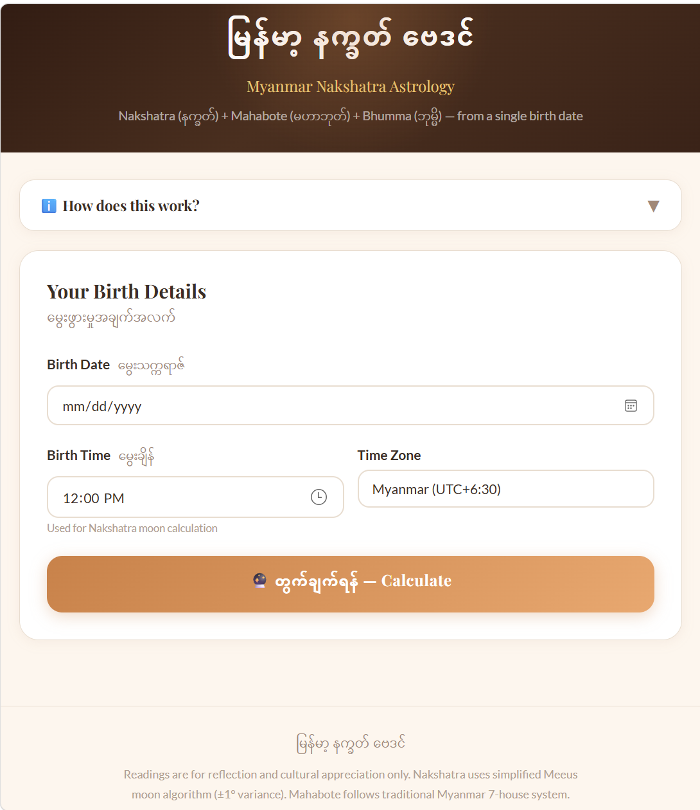

# မြန်မာ့ နက္ခတ် ဗေဒင် · Myanmar Nakshatra Astrology

> Combined Myanmar traditional astrology — Nakshatra (နက္ခတ်) · Mahabote (မဟာဘုတ်) · Kasit (ကသစ်) · Graha Riding (ဂြိုဟ်စီး) · Bhumma (ဘုမ္မိ) · AI Reading

**Live app:** [https://pyi-soe-ltd.github.io/Myanmar-BayDin/](https://pyi-soe-ltd.github.io/Myanmar-BayDin/)

---

## Screenshot



---

## Demo Video

<video src="public/MM_BayDin.mp4" controls width="100%"></video>

---

## Features

- 🌙 **Nakshatra (နက္ခတ်)** — Moon mansion at birth (27 lunar mansions), Pada, Lord, Gana, Deity, Rashi, Dasha cycle
- 🏠 **Mahabote (မဟာဘုတ်)** — Birth house from Myanmar year + weekday (7-house system)
- 🗓️ **Kasit Mahabote (ကသစ်မဟာဘုတ်)** — Current year transit house · ✅ ကံကောင်း / ⚠️ သတိထားရန်
- 🪐 **Graha Riding (ဂြိုဟ်စီးဂြိုဟ်နင်း)** — Full 7-house planet chart (မူလ + ကသစ်) with comparison & age-period ruler
- ⏱ **Bhumma (ဘုမ္မိ)** — Three pressure levels (Small / Core / Great) with active-year highlighting
- 🔮 **AI Reading** — Burmese-language diagnostic narrative combining all systems, powered by Azure AI Foundry
- 📅 Single date picker — auto-derives weekday, Myanmar year, afterNewYear, age
- 📱 Responsive, works on mobile

---

## Local Development

```bash
cd Myanmar-Astro
npm install
cp .env.example .env        # fill in your Azure AI Foundry keys
npm run dev                 # http://localhost:5173/
```

---

## GitHub Pages Deployment

### 1. Push to this repository

```bash
git remote set-url origin https://github.com/PYI-SOE-LTD/Myanmar-BayDin.git
git push origin main
```

### 2. Enable GitHub Pages

Go to repo → **Settings** → **Pages** → Source: **GitHub Actions**

### 3. Add GitHub Secrets

Go to **Settings** → **Secrets and variables** → **Actions**:

| Secret | Value |
|--------|-------|
| `VITE_FOUNDRY_ENDPOINT` | `https://YOUR-RESOURCE.openai.azure.com` |
| `VITE_FOUNDRY_KEY` | Your Azure AI Foundry API key |
| `VITE_FOUNDRY_MODEL` | Deployment name e.g. `gpt-5.2` |

### 4. Deploy

Push to `main` — GitHub Actions builds and deploys automatically.
Or: **Actions** → **Deploy to GitHub Pages** → **Run workflow**

---

## How It Works

| Layer | Input | Output |
|-------|-------|--------|
| **Nakshatra** | Birth date + time + timezone | Moon mansion, lord, gana, rashi, pada |
| **Mahabote** | Birth CE year + weekday | ဖွားဇာတာ (one of 7 houses) |
| **Kasit** | Current Myanmar year + weekday | This year's transit house |
| **Graha Riding** | Myanmar year (birth + current) | 7-house planet chart, age-period ruler |
| **Bhumma** | Age + birth weekday | Active pressure timing |
| **AI Reading** | All of the above | Burmese-language 6-section narrative |

> The AI prompt is sent client-side to Azure AI Foundry at runtime. The key is injected at build time from GitHub Secrets. For a public app, consider proxying through a backend.

---

## Reference

All calculations follow traditional methodology documented in:
- `Mahabote_astrology_reference4.md` — 22-section complete Myanmar astrology reference
- `graha_riding_guide.md` — Graha Riding full guide with +3 mod 7 formula

Sources: Myanmar Wikipedia · SharingKnowledges · CompuBaydaThukhuma · MyKyawZaya Blog

---

> **မြန်မာ့ဗေဒင်သည် ချက်ချင်းအဖြေပေးသည့် ပညာမဟုတ်ပါ —**
> **အလွှာလိုက် စစ်ဆေးသည့် ပညာရပ်ဖြစ်သည်။**
> *မှန်ကန်သောဆရာသည် ကံကြမ္မာကို မဟောပါ — တာဝန်ကို ထိုးဖော်ပြသည်။*
